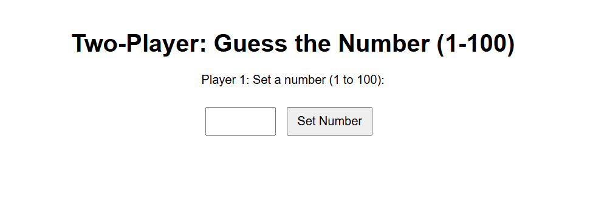
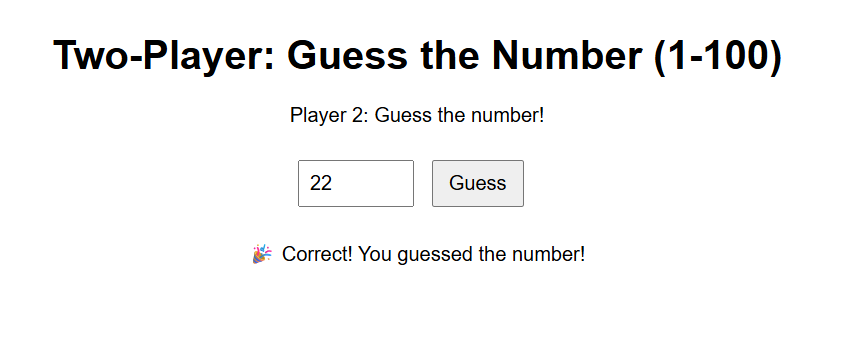

# 🎮 Two-Player Guess the Number Game (1-100)

This is a simple **two-player guessing game** built with **HTML, CSS, and JavaScript** and deployed via **GitHub Pages**.

- **Player 1** sets a secret number (from 1 to 100).
- The input gets hidden.
- **Player 2** then tries to guess the correct number based on hints.
- No backend required — runs entirely in the browser!

---

## 🚀 Live Demo

🔗 [Click to play the game](https://venkatasateesh8.github.io/Guess_My_Number_Website/)

---

## 🖼 Screenshot




---

## 📁 Files in This Repo

- `index.html`: Main game logic and layout
- `README.md`: Documentation and live demo link
- `guess_no_view1.png`: UI snapshot of the webpage before Player 1 enters the number
- `guess_no_view2.png`: UI snapshot of the webpage after Player 2 enters the number and got successed

---

## 🛠 How to Run Locally

1. Clone the repo  
   ```bash
   git clone https://github.com/VenkataSateesh8/Guess_My_Number_Website
